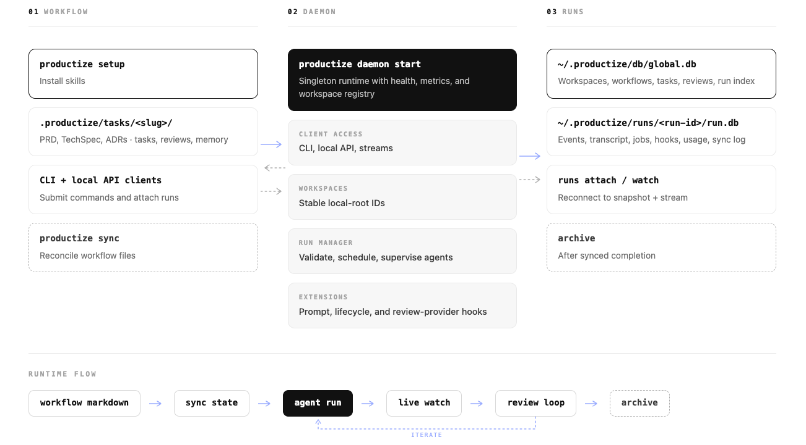

<p align="center">
  
</p>
Productize drives the product development lifecycle on top of the AI coding agents you
already use: idea, PRD, tech spec, codebase-informed task breakdown, multi-agent
execution, and review remediation. It ships 250+ routed product, design, QA, growth,
and engineering skills plus review gates, and keeps every artifact as editable
markdown in your repo while the daemon owns execution state — runs, streams, history,
and hooks — under `~/.productize`.

## What It Does

- Author PRDs, TechSpecs, ADRs, tasks, reviews, and memory in `.productize/tasks/<slug>/`.
- Sync authored markdown into the daemon catalog at `~/.productize/db/global.db`.
- Run ACP-capable agents through daemon-owned runs under `~/.productize/runs/<run-id>/`.
- Reattach to live or completed work with snapshot-plus-stream observation.
- Route work through product skills, reusable agents, review gates, and extension hooks.

## Why It Exists

A coding prompt gets you a diff. Shipping a product needs the work to hold together
across many runs and many agents:

- context survives between runs instead of restarting from scratch
- long-running work can be supervised, reconnected, and replayed
- review feedback becomes a tracked fix loop, not a copy-paste chore
- task files, run logs, transcripts, and status stay in sync
- product, design, QA, DX, metrics, release, and growth gates apply judgment — not just coding prompts

Productize handles this: it runs the agents, persists run state, routes work to the
right skill, and keeps the artifacts in your repo.

## Core Model

| Layer | Lives In | Owns |
| ----- | -------- | ---- |
| `WORKFLOW` | `.productize/tasks/<slug>/` | PRDs, TechSpecs, ADRs, task files, review issues, memory |
| `RUNTIME` | Productize daemon | workspace registry, validation, run scheduling, streams, hooks |
| `RUNS` | `~/.productize/runs/<run-id>/` | events, transcript projections, job state, token usage, integrity, terminal status |

Snapshots are rebuilt from persisted run data. Workspace markdown remains the
authoring surface; the daemon owns execution state.

## Quick Start

Install Productize:

```bash
brew install --cask itseffi/productize/productize
# or
npm install -g @productize/cli
# or
go install github.com/itseffi/productize/cmd/productize@latest
```

Install Productize skills and reusable agents into your local AI tools:

```bash
productize setup
```

Run a workflow:

```bash
productize sync --name user-auth
productize daemon start
productize daemon status
productize tasks validate --name user-auth
productize tasks run user-auth --ide claude
productize runs attach <run-id>
productize runs watch <run-id>
```

Close a review loop:

```bash
productize reviews fetch user-auth --provider coderabbit --pr 42
productize reviews fix user-auth --ide claude --concurrent 2 --batch-size 3
productize reviews watch user-auth
```

`productize tasks run` syncs the workflow before starting the daemon-owned run,
so explicit `productize sync` is useful for inspection and reconciliation but is
not required before every run.

## Runtime Flow

<p align="center">
  
</p>

## Productize-Specific Features

- **Daemon-owned run state.** The daemon owns workspace registration, run lifecycle, run databases, health, metrics, and attach/watch streams under `~/.productize`.
- **Snapshot plus stream reconnect.** `runs attach` and `runs watch` reconnect from persisted state, then continue through the live run stream.
- **Markdown-authored workflows.** Product work remains diffable and editable in `.productize/tasks/<slug>/`; the daemon stores indexes and run state.
- **Routed skill catalog.** `productize setup` installs the bundled skill catalog plus extension-provided skills into supported agents and editors.
- **Reusable agents.** Package prompts, runtime defaults, and optional agent-local MCP servers under `.productize/agents/<name>/` or `~/.productize/agents/<name>/`.
- **Review normalization.** CodeRabbit and extension-backed providers normalize feedback into markdown issue files that `reviews fix` can triage and resolve.
- **Review/fix/watch loops.** `reviews watch` waits for provider feedback, imports actionable rounds, starts child fix runs, and can optionally push committed fixes.
- **Extension hooks.** Executable extensions can observe lifecycle events, mutate prompts, inject plan sources, modify agent sessions, gate retries, ship skills or reusable agents, and register review providers.

## Skills And Gates

Productize routes product jobs to skills instead of asking every agent to
improvise the process.

Core workflow skills include:

| Skill | Owns |
| ----- | ---- |
| `create-prd` | product requirements with ADRs |
| `create-techspec` | technical design and architecture exploration |
| `create-tasks` | codebase-informed task decomposition |
| `execute-task` | implementation, validation, status, and handoff |
| `workflow-memory` | cross-run context and task-local memory |
| `review-round` | structured code review issues |
| `fix-reviews` | issue triage, fixes, verification, and provider resolution |
| `final-verify` | evidence gate before completion claims |

Product gates include engineering, design, QA, DX, docs, release, metrics,
communications, and growth review skills. The broader Productize catalog covers
strategy, research, design, analytics, finance, operations, experimentation,
go-to-market, and AI product execution.

Optional first-party ideation lives in the `idea-forge` extension:

```bash
productize ext install --yes itseffi/productize --remote github --ref main --subdir extensions/idea-forge
productize ext enable idea-forge
productize setup
```

## Supported Agents

Productize executes through ACP-capable runtimes:

| Runtime | `--ide` |
| ------- | ------- |
| Claude Code | `claude` |
| Codex | `codex` |
| GitHub Copilot | `copilot` |
| Cursor | `cursor-agent` |
| Droid | `droid` |
| OpenCode | `opencode` |
| Pi | `pi` |
| Gemini | `gemini` |

`productize setup` can install skills into 44 agents and editors, including
Claude Code, Codex, Cursor, Droid, OpenCode, Pi, Gemini CLI, GitHub Copilot,
Windsurf, Amp, Continue, Goose, Roo Code, Augment, Kiro CLI, Cline, and more.

Execution runtimes are separate from skill installation. To run `productize
exec`, `productize tasks run`, or `productize reviews fix`, install the
ACP-capable runtime or adapter for the `--ide` you choose.

## Authoring Details

Each artifact type carries its own YAML frontmatter: task files, review issues,
skills (`SKILL.md`), reusable agents (`AGENT.md`), and ADRs all have distinct fields.
Task files use:

```md
---
status: pending
title: Add task validation preflight to tasks run
type: backend
complexity: medium
dependencies:
  - task_02
---
```

`type` must come from `[tasks].types` in `.productize/config.toml` or the built-in
defaults: `frontend`, `backend`, `docs`, `test`, `infra`, `refactor`, `chore`,
and `bugfix`.

Validate task files at any time:

```bash
productize tasks validate --name user-auth
```

If you have older XML-tagged artifacts, run:

```bash
productize migrate
```

## Ad Hoc Exec

Use `productize exec` for one prompt through the same ACP-backed execution stack
without creating a full workflow first.

```bash
productize exec "Summarize the current repository changes"
productize exec --prompt-file prompt.md
cat prompt.md | productize exec --format json
productize exec --persist "Review the latest changes"
```

Persisted exec runs store resumable state under `~/.productize/runs/<run-id>/`:

```text
~/.productize/runs/<run-id>/run.db
~/.productize/runs/<run-id>/run.json
~/.productize/runs/<run-id>/events.jsonl
~/.productize/runs/<run-id>/turns/0001/prompt.md
~/.productize/runs/<run-id>/turns/0001/result.json
```

`productize exec` uses the same config merge rule as the rest of the CLI:

```text
flags > workspace [exec] > workspace [defaults] > global [exec] > global [defaults] > built-in defaults
```

## Reusable Agents

Reusable agents are filesystem bundles discovered from two scopes:

- workspace: `.productize/agents/<name>/`
- global: `~/.productize/agents/<name>/`

Each agent contains a required `AGENT.md` and optional `mcp.json`. Run them with:

```bash
productize agents list
productize agents inspect reviewer
productize exec --agent reviewer "Review the staged changes"
```

## Extensions

Extensions are JSON-RPC subprocess plugins. They can observe or modify runtime
behavior without rebuilding Productize.

```bash
productize ext list
productize ext install <source>
productize ext enable <name>
productize ext doctor
```

Extension SDKs:

- [Go SDK](sdk/extension/)
- [TypeScript SDK](sdk/extension-sdk-ts/)

## Development

```bash
make verify    # Full pipeline: fmt, lint, test, build
make fmt       # Format code
make lint      # Lint with zero tolerance
make test      # Tests with race detector
make build     # Compile binary
make deps      # Install development dependencies
make tidy      # Tidy Go modules
```
