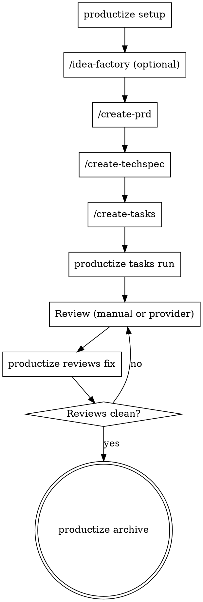

# Productize Reference Guide

Comprehensive reference for the Productize CLI and its AI-assisted development workflow.

## What Is Productize

Productize is a Go CLI that orchestrates the full lifecycle of AI-assisted development. It covers product ideation, technical specification, task decomposition, automated execution via AI coding agents, and PR review remediation.

Key characteristics:

- **Agent-agnostic.** Supports claude, codex, copilot, cursor-agent, droid, gemini, opencode, and pi as ACP runtimes.
- **Skills-based.** Bundled Productize workflow skills and Productize product-operating skills (installed via `productize setup`) teach agents how to execute each workflow phase.
- **Artifact-driven.** Planning and review artifacts live as markdown under `.productize/tasks/<slug>/`, versioned alongside the codebase.
- **Daemon-backed runtime.** A home-scoped daemon owns run state, workspace registration, snapshots, streams, and the synced `global.db` catalog under `~/.productize/`.
- **Single binary, local-first.** The daemon is launched from the same binary; there are no external control planes.

## Workflow Pipeline Overview

The standard development pipeline follows these phases in order. Each phase produces artifacts consumed by the next.

1. **Setup** -- `productize setup` installs core skills into target agents plus any setup assets shipped by enabled extensions.
2. **Ideation** (optional) -- install and enable the first-party `idea-factory` extension, run `productize setup`, then use `/idea-factory` to expand a raw idea into a structured, research-backed spec at `.productize/tasks/<slug>/_idea.md`.
3. **Requirements** -- `/create-prd` creates a business-focused Product Requirements Document at `.productize/tasks/<slug>/_prd.md` with ADRs.
4. **Technical Design** -- `/create-techspec` translates the PRD into a technical specification at `.productize/tasks/<slug>/_techspec.md` with ADRs.
5. **Task Decomposition** -- `/create-tasks` breaks down the PRD and TechSpec into independently implementable task files (`task_01.md`, `task_02.md`, etc.) and a master list at `_tasks.md`.
6. **Execution** -- `productize tasks run <slug> --ide <runtime>` dispatches task files sequentially to the configured AI agent for implementation.
7. **Review** -- `/review-round` (manual AI review) or `productize reviews fetch <slug> --provider coderabbit --pr <N>` (external provider) produces review issue files under `reviews-NNN/`.
8. **Remediation** -- `productize reviews fix <slug>` processes review issues, triages, fixes, and verifies each one.
9. **Archive** -- `productize archive --name <slug>` moves fully completed workflows to `.productize/tasks/_archived/`.

Repeat phases 7-8 until the review is clean, then merge.



For a detailed step-by-step walkthrough of each phase, read `references/workflow-guide.md`.

## CLI Commands Quick Reference

| Command | Purpose | Key Flags |
| --- | --- | --- |
| **Setup & Config** | | |
| `productize setup` | Install core skills and enabled extension assets | `--agent`, `--skill`, `--global`, `--copy`, `--list`, `--all`, `--yes` |
| `productize upgrade` | Update CLI to latest release | |
| **Workflow Execution** | | |
| `productize daemon` | Manage the home-scoped daemon lifecycle | `start`, `status`, `stop` |
| `productize workspaces` | Inspect and manage daemon workspace registrations | `list`, `show`, `register`, `unregister`, `resolve` |
| `productize tasks run` | Execute PRD task files through the daemon | `--name`, `--attach`, `--ui`, `--stream`, `--detach`, `--task-runtime` |
| `productize exec` | Execute an ad hoc prompt | `--agent`, `--format`, `--prompt-file`, `--tui`, `--persist`, `--run-id` |
| `productize runs` | Attach, watch, and purge daemon-managed runs | `attach`, `watch`, `purge` |
| **Review** | | |
| `productize reviews fetch` | Fetch provider review comments | `--provider`, `--pr`, `--name`, `--round` |
| `productize reviews fix` | Process review issue files | `--name`, `--round`, `--concurrent`, `--batch-size`, `--ide` |
| **Utilities** | | |
| `productize tasks validate` | Validate task file metadata | `--name`, `--tasks-dir`, `--format` |
| `productize sync` | Reconcile workflow artifacts into daemon `global.db` | `--name`, `--root-dir`, `--tasks-dir` |
| `productize archive` | Move daemon-eligible completed workflows to archive | `--name`, `--root-dir`, `--tasks-dir` |
| `productize migrate` | Convert legacy artifacts to frontmatter | `--name`, `--dry-run`, `--reviews-dir` |
| **Agent Management** | | |
| `productize agents list` | List resolved reusable agents | |
| `productize agents inspect` | View agent definition and defaults | `<name>` |
| **Extensions** | | |
| `productize ext list` | List extensions | |
| `productize ext inspect` | View extension details | `<name>` |
| `productize ext install` | Install an extension from a local path or GitHub repo archive | `<source>`, `--remote`, `--ref`, `--subdir` |
| `productize ext uninstall` | Remove an extension | `<name>` |
| `productize ext enable/disable` | Toggle extension | `<name>` |
| `productize ext doctor` | Diagnose extension issues | |

Common flags shared by `tasks run`, `exec`, and `reviews fix`: `--ide`, `--model`, `--reasoning-effort`, `--add-dir`, `--auto-commit`, `--dry-run`.

For complete flag documentation, read `references/cli-reference.md`.

## Core Skills Summary

| Skill | Trigger | When To Use | Do Not Use For |
| --- | --- | --- | --- |
| `create-prd` | `/create-prd` | Building a Product Requirements Document | TechSpec, task breakdown, coding |
| `create-techspec` | `/create-techspec` | Translating PRD into technical design | PRD creation, task execution |
| `create-tasks` | `/create-tasks` | Decomposing PRD+TechSpec into task files | Execution, review |
| `execute-task` | (internal) | Executing a single PRD task (called by `productize tasks run`) | Direct invocation, review work |
| `review-round` | `/review-round` | Performing comprehensive code review | Fetching external reviews, fixing |
| `fix-reviews` | (internal) | Remediating review issues (called by `productize reviews fix`) | Fetching reviews, task execution |
| `final-verify` | `/final-verify` | Enforcing verification before completion claims | Early planning, brainstorming |
| `workflow-memory` | (internal) | Maintaining cross-task workflow memory | PR reviews, user preferences |
| `productize-runtime` | `/productize-runtime` | Learning how to use the Productize CLI runtime | Executing workflow steps |

## Productize Skills Summary

Productize skills are bundled alongside the Productize workflow skills. Use
`/productize` as the Productize router, or call namespaced skills directly when
the job is clear.

| Skill | Trigger | When To Use |
| --- | --- | --- |
| `productize` | `/productize` | Route product, strategy, growth, delivery, design, analytics, finance, launch, or AI-builder work |
| `productize-0-1` | `/productize-0-1` | Turn a raw product idea or new capability bet into a first shipped slice |
| `productize-product-review` | `/productize-product-review` | Review product scope, requirements, tradeoffs, and acceptance criteria |
| `productize-design-review` | `/productize-design-review` | Review UX, hierarchy, interaction quality, and visual polish |
| `productize-eng-review` | `/productize-eng-review` | Review architecture, implementation risk, data flow, and build readiness |
| `productize-qa` | `/productize-qa` | Define or review verification evidence, scenarios, evals, and regression risk |
| `productize-release` | `/productize-release` | Check ship readiness, rollback paths, launch blockers, and release evidence |

## Optional Extension Skills

| Skill | Trigger | When To Use | Install Flow |
| --- | --- | --- | --- |
| `idea-factory` | `/idea-factory` | Raw feature idea needs structured exploration before a PRD | `productize ext install --yes itseffi/productize --remote github --ref <tag> --subdir extensions/idea-factory` -> `productize ext enable idea-factory` -> `productize setup` |

For detailed skill descriptions and inputs/outputs, read `references/skills-reference.md`.

## Artifact Directory Structure

```
.productize/
  config.toml                          # Workspace configuration
  tasks/
    <slug>/                            # One directory per workflow
      _idea.md                         # Idea spec (from idea-factory)
      _prd.md                          # Product Requirements Document
      _techspec.md                     # Technical Specification
      _tasks.md                        # Master task list
      task_01.md ... task_N.md         # Individual task files
      adrs/
        adr-001.md ... adr-NNN.md      # Architecture Decision Records
      reviews-NNN/
        issue_001.md ... issue_N.md    # Review issues with round metadata in frontmatter
      memory/
        MEMORY.md                      # Shared workflow memory
        task_01.md ... task_N.md       # Per-task memory
    _archived/
      <timestamp>-<slug>/             # Archived completed workflows
  agents/
    <name>/                            # Workspace-scoped reusable agents
      AGENT.md                         # Agent definition
      mcp.json                         # Optional MCP server config
  extensions/                          # Workspace-scoped extensions
```

Global paths:
- `~/.productize/agents/<name>/` -- global reusable agents (workspace overrides global)
- `~/.productize/extensions/` -- user-scoped extensions
- `~/.productize/runs/<run-id>/` -- daemon-managed run artifacts and persisted exec sessions
- `~/.productize/global.db` -- daemon workspace, workflow, task, and review catalog

## Configuration

Workspace defaults live in `.productize/config.toml`. CLI flags always override config values.

```toml
[defaults]
ide = "claude"
model = "opus"
auto_commit = true
reasoning_effort = "high"
add_dirs = ["../shared-lib"]

[tasks]
types = ["frontend", "backend", "docs", "test", "infra", "refactor", "chore", "bugfix"]

[tasks.run]
include_completed = false

[fix_reviews]
concurrent = 2
batch_size = 3

[fetch_reviews]
provider = "coderabbit"
nitpicks = false

[exec]
verbose = false
tui = false
persist = false
```

For all fields, types, and defaults, read `references/config-reference.md`.

## Reusable Agents and the Council Pattern

Reusable agents are standalone personas that can be invoked via `productize exec --agent <name>` or referenced by skills through `run_agent`.

**Discovery order:** workspace (`.productize/agents/<name>/`) overrides global (`~/.productize/agents/<name>/`).

**Agent definition:** Each agent has an `AGENT.md` with YAML frontmatter (`title`, `description`) and optional `mcp.json` for MCP server configuration.

**Council agents shipped by the optional `idea-factory` extension**:

| Agent | Perspective |
| --- | --- |
| `pragmatic-engineer` | Execution-focused, delivery speed, maintenance burden |
| `architect-advisor` | Long-term system coherence, boundaries, coupling |
| `security-advocate` | Attack vectors, compliance, data protection |
| `product-mind` | User impact, business value, opportunity cost |
| `devils-advocate` | Challenges assumptions, surfaces risks, stress-tests |
| `the-thinker` | Cross-domain patterns, structural reframing |

Install flow: `productize ext install --yes itseffi/productize --remote github --ref <tag> --subdir extensions/idea-factory` -> `productize ext enable idea-factory` -> `productize setup`.

The `idea-factory` skill uses these agents in a council debate to challenge feature scope and surface risks. The `council` skill can also orchestrate multi-advisor debates on demand.

Management commands: `productize agents list`, `productize agents inspect <name>`.

## Extensions

Executable plugins that extend Productize at runtime via JSON-RPC 2.0 on stdin/stdout.

- **Three scopes:** bundled (shipped with Productize), user (`~/.productize/extensions/`), workspace (`.productize/extensions/`). Workspace overrides user overrides bundled.
- **Disabled by default.** Enable explicitly with `productize ext enable <name>` or `--extensions` flag on `exec`.
- **Capabilities:** lifecycle observation, prompt decoration, plan injection, agent session modification, review provider registration.
- **SDKs:** TypeScript (`@productize/extension-sdk`), Go (`sdk/extension`).
- **Scaffolding:** `npx @productize/create-extension` generates extension boilerplate.

Management: `productize ext list`, `productize ext inspect <name>`, `productize ext install <source>`, `productize ext uninstall <name>`, `productize ext enable/disable <name>`, `productize ext doctor`.

## Common Patterns

- Run `productize setup` before starting any workflow to ensure core skills and enabled extension assets are installed.
- Follow the pipeline in order: idea (optional) -> PRD -> TechSpec -> Tasks -> Execution -> Review -> Fix.
- Configure workspace defaults in `.productize/config.toml` to reduce repetitive CLI flags.
- Run `productize tasks validate --name <slug>` before `productize tasks run` to catch metadata issues early.
- Use `productize archive` to clean up fully completed workflows and keep the tasks directory focused.
- Use `productize exec --agent <name>` for ad hoc prompts with a specific advisor perspective.
- Use `productize exec --persist` to save session artifacts for later resumption with `--run-id`.

## Anti-Patterns

- **Skipping pipeline stages.** Running `productize tasks run` without a PRD and task files produces poor results.
- **Invoking `execute-task` directly.** Use `productize tasks run`, which handles dispatch, sequencing, memory, and tracking.
- **Mixing workflow skills out of order.** Running `/create-tasks` without a PRD and TechSpec leads to shallow task decomposition.
- **Editing task file frontmatter manually.** Use `productize migrate` or `productize tasks validate` to fix metadata issues programmatically.
- **Confusing skills with CLI commands.** Skills (slash commands like `/create-prd`) run inside an agent session. CLI commands (`productize tasks run`) run in the terminal.
- **Skipping verification.** Always use `final-verify` before claiming task completion or creating commits.
